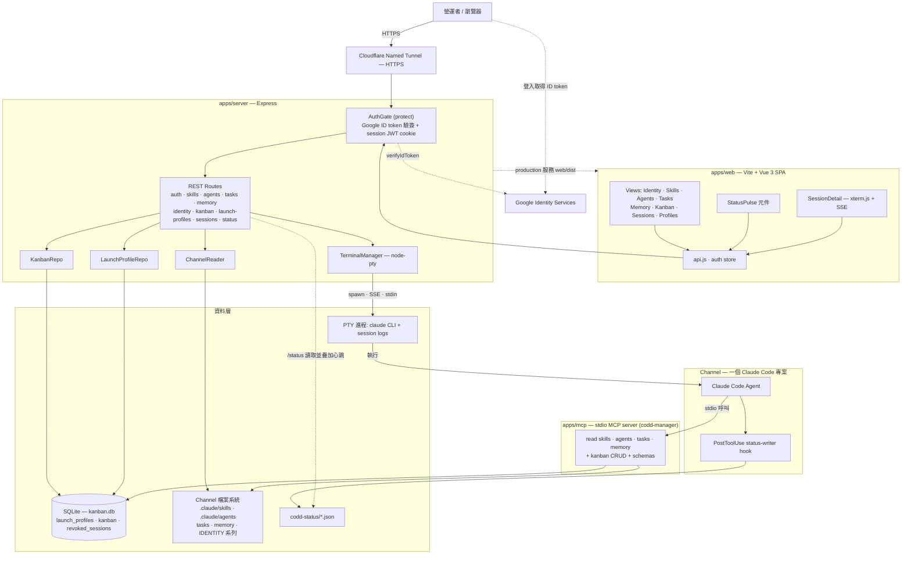
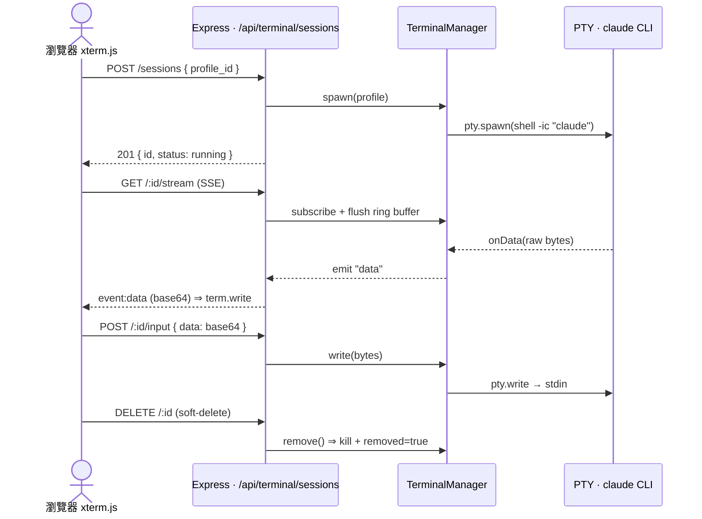

# 🎛️ Fancy CODD — Claude Code Channel Manager

本地端 Express + SQLite + Vite/Vue SPA，**外部用 Cloudflare named tunnel 提供 HTTPS**，**Google Identity Services + ID Token 認證**（無需 client secret），附帶 stdio MCP server 讓 channel 內的 Claude Code agent 自助查詢平台資料。

## 功能

| 模組 | 內容 |
|---|---|
| 📚 Skills | 列出 `$CHANNEL_PATH/.claude/skills/*/SKILL.md`，可線上編輯 frontmatter + body |
| 🤖 Agents | 列出 `.claude/agents/*.md`，可編輯 |
| ⏰ Tasks | 列出 `tasks/*.md`，可編輯 cron / prompt（不重啟 cron） |
| 🧠 Memory | 唯讀，按日期渲染 markdown |
| 📋 Kanban | Ad-hoc Todo 看板，SQLite 儲存，拖拽切換欄位 |
| 🔌 MCP | stdio MCP server，提供 read + Kanban CRUD tools |

## 架構

npm workspaces monorepo（`apps/server` + `apps/web` + `apps/mcp`），對外只開一個 Cloudflare named tunnel，Google ID Token 認證；附一個 stdio MCP server 讓 channel 內的 Claude Code agent 自助查平台資料。下圖為整體元件與資料流：



### 目錄結構

```
2026-remote-claude-code-manager/
├── apps/
│   ├── server/   # Express + better-sqlite3 + Google ID Token verify
│   ├── web/      # Vite + Vue 3 SPA
│   └── mcp/      # @modelcontextprotocol/sdk stdio server
├── configs/
│   ├── cloudflared.yml.example
│   └── google-oauth-setup.md
├── .env.example
└── README.md
```

### 即時終端機資料流（PTY ↔ SSE ↔ xterm.js）

Sessions 模組把一個 launch profile 在後端 spawn 成 PTY（跑 `claude`），輸出走 SSE 推到瀏覽器的 xterm.js，鍵盤輸入則走 POST 回寫 PTY stdin；DELETE 為 soft-delete（從預設列表移除，filter 可顯示）。



## 安裝

需要 Node.js 20+ 與 macOS / Linux。

```bash
# clone 完進到 root
cp .env.example .env
cp apps/web/.env.example apps/web/.env
# 編輯 .env、填入 CHANNEL_PATH / GOOGLE_CLIENT_ID / ALLOWED_EMAIL / SESSION_SECRET

# 安裝
npm install

# 初始化 SQLite
npm --workspace apps/server run migrate
```

### 生 SESSION_SECRET

```bash
node -e "console.log(require('crypto').randomBytes(32).toString('hex'))"
```

### 設 Google OAuth

照 [configs/google-oauth-setup.md](configs/google-oauth-setup.md) 一步一步做。

## 開發

```bash
npm run dev
# Express  → http://localhost:3000
# Vite     → http://localhost:5173  （前端用這個開）
```

Vite proxy 會把 `/api/*` 轉到 Express。

## 上線

```bash
npm run build     # 把 apps/web 編譯到 apps/web/dist
npm start         # NODE_ENV=production，Express 同時服務 API 跟靜態檔
npm run tunnel    # cloudflared 起 named tunnel（需先按 configs/cloudflared.yml.example 設定）
```

建議用 launchd / systemd / pm2 讓兩個 process 都自動啟動。

## 接 MCP 進你的 channel

在你的 channel `.mcp.json` 加：

```json
{
  "mcpServers": {
    "codd-manager": {
      "command": "node",
      "args": ["/abs/path/to/2026-remote-claude-code-manager/apps/mcp/src/index.js"],
      "env": {
        "CHANNEL_PATH": "/abs/path/to/2026-local-AI-Agent",
        "KANBAN_DB_PATH": "/abs/path/to/2026-remote-claude-code-manager/apps/server/data/kanban.db"
      }
    }
  }
}
```

Claude Code session 啟動後，agent 會自動看到 `mcp__codd-manager__list_skills` 等 tools。

### MCP tools 清單

| Tool | 用途 |
|---|---|
| `list_skills` / `get_skill` | 讀 skills |
| `list_agents` / `get_agent` | 讀 agents |
| `list_tasks` / `get_task` | 讀 tasks |
| `list_memory_days` / `get_memory_day` | 讀 memory |
| `kanban_list_cards` / `kanban_get_card` | 查 Kanban |
| `kanban_create_card` / `kanban_update_card` / `kanban_delete_card` | 改 Kanban |

**MCP 預設不能直接改 skills / agents / tasks 檔案** — 這些只能透過 Web UI 編輯，避免 agent 誤改重要設定。

## 擴充 Channel（hooks / sub-agents）

Fancy CODD 提供兩個可注入 channel 的擴充：

| 模組 | 內容 |
|---|---|
| **PostToolUse hook** | 把 session 狀態（last tool / tool count / idle）寫進 `STATUS_FILE_PATH`，平台 sidebar 顯示 |
| **frontmatter-doctor sub-agent** | 對 channel 內 agents / skills 的 frontmatter 體檢，產 audit 報告 |
| **codd-manager MCP** | 把 MCP server 掛進 channel `.mcp.json`，agent 可呼叫 kanban / schema tools |

三個模組透過一個 CLI 管整套生命週期：

```bash
npm run channel status      # 看現況
npm run channel install     # 安裝（已存在則 skip）
npm run channel update      # 升級
npm run channel uninstall   # 卸載（軟卸載；--purge 連檔案刪）

# 共通 flags
--dry-run            # 只印 diff 不寫
--only hooks,mcp     # 只動指定部分
--channel <path>     # 覆蓋 .env 的 CHANNEL_PATH
```

完整指引：[configs/INSTALL.md](configs/INSTALL.md)

## 驗證

對應 plan 的 verification 清單見 `~/.claude/plans/claude-code-fancy-codd.md`。

## 安全模型

- Google Identity Services 用 ID token（JWT signed by Google）
- 後端 `verifyIdToken({ audience: GOOGLE_CLIENT_ID })` 驗簽 + 防 replay
- `email === ALLOWED_EMAIL` 且 `email_verified === true` 才放行
- 自家 session JWT 透過 **HTTP-only + Secure + SameSite=Strict cookie** 派發
- CSP header 限制 script-src 只能來自 self 與 `accounts.google.com`
- 寫入 API 一律 POST/PATCH/DELETE
- 詳見 [configs/google-oauth-setup.md](configs/google-oauth-setup.md)

## License

Private / MIT for personal use.
